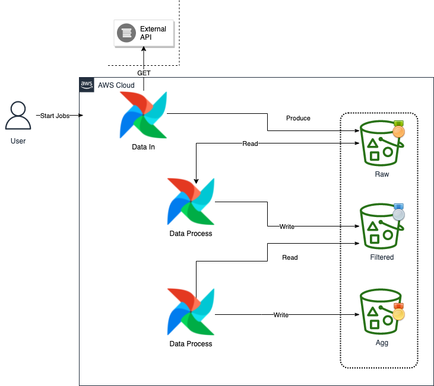
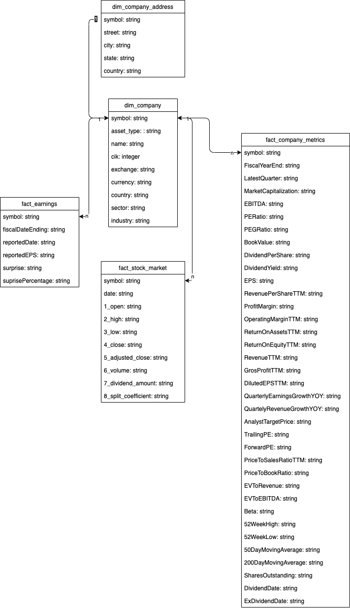
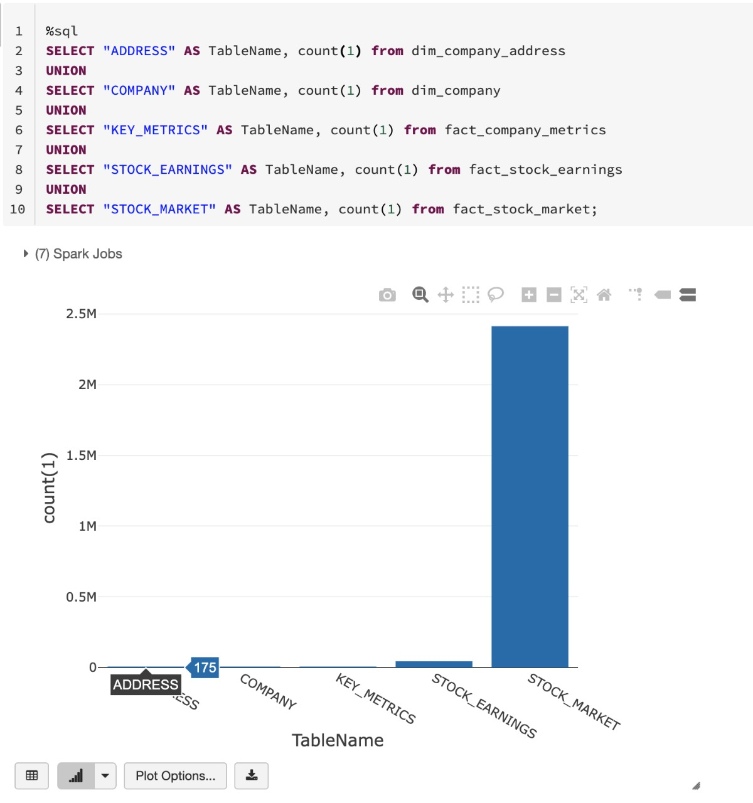

# Big Data for Financial Market

This project was developed for the capstone of [Data Engineer Nanodegree](https://www.udacity.com/course/data-engineer-nanodegree--nd027)

## Overview

The project intends to carry out the collection, transformation and analysis of data related to the financial market, more precisely, the collected data refer to the S&P500 index. The processed data can be used to perform new asset purchases, portfolio rebalancing, fundamental analysis, risk analysis and much more.

## Resources Used

- AlphaVantage API;
- Apache Airflow;
- Apache Spark;
- Pandas;
- AWS EC2;
- AWS S3;
- Docker;
- Databricks Community;

## Architecture 

The architecture that was used was designed to minimize operating costs and maximize the amount of data loads to be processed, in this way we can generate more value to the business and make better decisions in the end.



## Environment Setup 

To run the environment, just create a virtual machine on AWS EC2, install Git with the command:

```
$ apt-get install git-all
```

After this installation, you will be able to clone this project. From there it accesses the capstone's path and will need to run docker-compose at the root of the project.

If you don't have Docker installed on your machine, you can install it using the following commands:

1. Update the packages and use apt to install the packages listed below:
```sh
$ sudo apt-get update

$ sudo apt-get install \
    apt-transport-https \
    ca-certificates \
    curl \
    gnupg-agent \
    software-properties-common
```

2. Add the official Docker GPG key:
```sh
$ curl -fsSL https://download.docker.com/linux/ubuntu/gpg | sudo apt-key add -
```

3. To find the key use the command:
```sh
$ apt-key list
```

4. Check that you now have the key as fingerprint of type ```9DC8 5822 9FC7 DD38 854A E2D8 8D81 803C 0EBF CD88```, take the last eight digits.
```sh
$ apt-key fingerprint 0EBFCD88
```

6. Use the following command to set up the stable repository:
```sh
$ add-apt-repository \
   "deb [arch=amd64] https://download.docker.com/linux/ubuntu \
   $(lsb_release -cs) \
   stable"
```

7. Update the packages again, using ```apt```:
```sh
$ apt-get update
```

8. To install the latest version we can run the following command::
```sh
$ apt-get install docker-ce docker-ce-cli containerd.io
```

9. Check the docker version to "confirm" the installation:
```sh
$ docker --version
```

10. Download docker compose
```sh
$ sudo curl -L "https://github.com/docker/compose/releases/download/1.29.2/docker-compose-$(uname -s)-$(uname -m)" -o /usr/local /bin/docker-compose
```

11. Apply executable permissions to the binary:
```sh
$ sudo chmod +x /usr/local/bin/docker-compose
```

After going through the installation process, just do a ```docker-compose up -d``` and wait while the services are being provisioned on your machine.

After all the services change to a ```running``` status, you can access the environments of each one of them and start processing the data.

The services that will perform the orchestration of the pipelines will be Airflow, it has DAG's ***(Directed acyclic graph)*** where you can perform the allocation of operations such as loading data from one path to another.

## Data Models

The data modeling was developed thinking about carrying out a better grouping of data so that the business fronts can make better decisions when looking at the data treated in the gold layer.



## Data Dictionary

To access the data dictionary, just [click here](./docs/datadictionary.md)

## Data Pipelines
- PIPE_DATALAKE_SETUP
    - Pipeline responsible for creating the Datalake environment and publishing all S&P500 companies.

- PIPE_FINANCE_DATA_EXTRACTOR
    - Pipeline responsible for collecting data from in AlphaVantage API ([Endpoints](docs/endpoints.md)) and ingesting data in the bronze layer (raw data).

- PIPE_FINANCE_DATA_PROCESSING
    - Pipeline responsible for collecting data from the bronze layer and normalizing the data to a tabular form, at the end it will write the data on the silver layer.

- PIPE_FINANCE_DATA_QUALITY_ASSURANCE
    - Pipeline responsible for evaluating data quality in data lake buckets.
    - This pipeline has two interactions with the data present in the data lake:
        1. It evaluates whether data entering the lake is being listed within the lake;
        2. It evaluates if the symbol of the company being interacted with does not have a sematic problem in the name, otherwise it returns an error and requests a change as soon as possible. This helps that errors do not occur within the interactions performed by further processing.

- PIPE_FINANCE_GOLD_PROCESSING
    - Pipeline responsible for creating the gold layer and creating the dimension and facts layers that will be used in the business.

## Data Lake Layers

Data Lake was modeled thinking about improving the storage process and standardizing the organizational structure.

- Bronze 
    - Bucket to store raw data;
    - Organizational structure:
        - stock_method={}/company={}/{stock_method}.json

- Silver:
    - Bucket to store filtered data;
    - Organizational structure:
        - stock_method={}/company={}/{stock_method}.parquet

- Gold:
    - Bucket to store data aligned with the business layer;
    - Organizational structure:
        - dim_company.parquet
        - dim_company_address.parquet
        - fact_company_metrics.parquet;
        - fact_earnings.parquet;
        - fact_stock_market.parquet;


## Pipeline Workflow Overview

- Run ***PIPE_DATALAKE_SETUP*** to build the datalake and publish the data of the S&P500 companies.

- Run ***PIPE_FINANCE_DATA_EXTRACTOR*** to collect data from AlphaVantage.

- Run ***PIPE_FINANCE_DATA_QUALITY_ASSURANCE*** to assess the quality of data within the bronze layer.

- Run ***PIPE_FINANCE_DATA_PROCESSING*** to normalize the data.

- Run ***PIPE_FINANCE_DATA_QUALITY_ASSURANCE*** to assess the quality of the data inside the silver layer.

- Run ***PIPE_FINANCE_GOLD_PROCESSING*** to create the gold layer and dimension and fact tables.

- Run ***PIPE_FINANCE_DATA_QUALITY_ASSURANCE*** to assess data quality within the gold layer.

- Connect to ***gold*** layer via self service BI to perform data analysis and build business-applied dashboards to make better decisions.

## Pipelines Run

To run all the pipelines mentioned above, just access the Airflow UI `http://< ec2-instance-ip >:< configured-port >` and set the pipelines to run in the sequence informed in the previous topic.

## Table Analysis

A preliminary analysis on top of data distribution within the gold data layer. I used Databricks as a form of programmatic access to use SQL Analytics and access parquet files with native SQL.



## Scenarios

- Data increase by 100x. read > write. write > read

    - Increase Spark Submit size to handle bigger volume of data;
    - I've setup the `"fs.s3.buffer.dir"` as `"/root/spark/work,/tmp"` and this possible to work with bigger volume of data;

- Pipelines would be run on 7am daily. How to update dashboard? Would it still work?

    - DAG is scheduled to run every 10 minutes and can be configured to run every morning at 7 AM if required.

- The dataset must be updated on a daily basis, as the fact_stock_market table, which is provisioned within the gold layer, is a table that has all the market data for the shares of the ***S&P500 companies***, so it will be necessary to run the pipeline completely in all days. In this case, we will have a complete way of analyzing the ***D-1*** data.

- Make it available to 100+ people
    - As we are using S3 as our Data Lake, it does not differ the amount of people, it will support the amount of requests and we will not have access concurrency problems.
